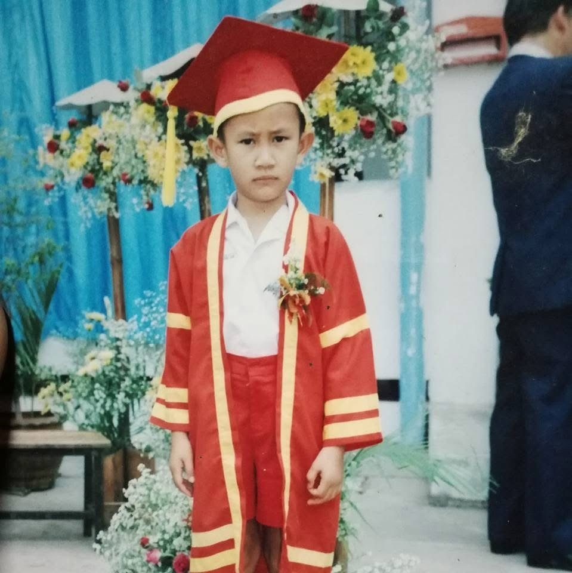

# **Prakasit (Pie) Iammala**
**Department of Mechatronics and Robotics**
**Surin Technical College**

# **EDUCATION**
## **Master's Student in Mechatronics and Robot Systems**
**Suranaree University of Technology**

## **Graduate Diploma in Mechatronics Teaching Profession**
**The Eastern University of Management and Technology**

## **Bachelor of Engineering in Mechatronics Engineering**
**Rajamangala University of Technology Isan(RMUTI)**
**Graduated with a Bachelor's degree in 2023**

## **Graduated from high school in the gifted class.**
**Triam Udom Suksa Phatthanakan Ubon Ratchathani School**

## **Graduated from First School.**
**Thetsaban Burapha Ubon School**

  

